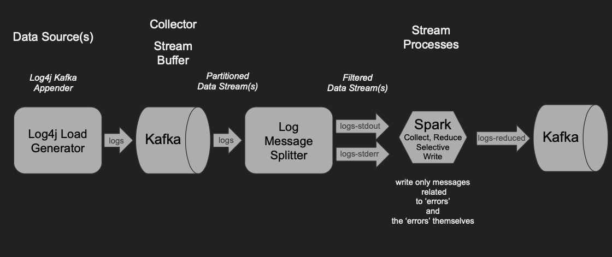

# log-message-reducer

A project to see the "join" function in Spark Structured Streaming. The goal is to reduce log messages coming from two topics, one to represent messages logged as error, and one to represent messages logged as other than error but some that are directly related to the errors by means of a tracking id.



## Required Environment:
### Java Jdk 8
### Maven 3.6
### Scala 2.11
### Kafka 2.11-0.10.2.1 (tested with this, later versions may work the same)
### Spark 2.4.1
### Docker & Docker Compose (optional)

## Setup Options
### Run Virtualbox/Vagrant
A Vagrantfile is included that will build a CentOS VM and provision it with all the aforementioned Required Environment items.

### Install Manually
There is an ```install/``` directory included which has individual installation scripts for everything. There is a sequence of installation that is required. For each script, a new environment variable is set, so you need to run the scripts as root (or "sudo su -") and then exit that session and sudo back in in order to set these Environment variables for the next step. At the end, you should be able to all of them. You need these components all installed and environment variables set.
```
$ env |grep HOME
KAFKA_HOME=/vagrant/kafka-proxied/local/kafka/default
SPARK_HOME=/usr/spark/default
MAVEN_HOME=/usr/maven/default
JAVA_HOME=/usr/java/default
SCALA_HOME=/usr/scala/default
```
### Use an existing installation
You can pick and choose anything that is missing but in the end you will still need the same environment variables set to run the operational scripts. You will need to set these individually and appropriately for your installation.

**Note: that Spark 2.4.1 had dependencies with security vulnerabilities at the time this was put together. Moving to Spark 2.4.2 resolves some of those issues but seems to bring in a logging dependency issue - Since this is NOT intended to be a Production configuration/runtime, I choose the 2.4.1 path for now and will resolve the 2.4.2 issues later.**

## Pre-requisite Steps

### Install all dependencies
Make sure you install each of the following as outlined above.

### Run Maven Priming Build
There are three projects that need to be fully built first so that all dependencies are pulled down and assembled. You can go an do a full ```mvn clean install``` in each of the three project directories (```log-message-generator/, log-message-reducer-uber-jar/, log-message-reducer/```) or just run the following script to do the same.  
```
$ ./run_maven_priming_build.sh
```

### Create Kafka Topics
You need to have a running Kafka Cluster or standalone server up and running. Installing Kafka as outlined before only will install Kafka client libraries and utilities on the client machine. If you intend on using the same machine or to stand up a small Kafka cluster for development and testing then the recommendation is to clone another repo with the scripts required to setup and configure Kafka.
Clone "kafka-cluster-quick" and follow the instructions there. There are scripts to stand up and tear down a single or multi-node cluster.
```
$ git clone https://github.com/petergdoyle/kafka-cluster-quick.git
```
Once a Kafka cluster is available, you need to create the required topics. There is a script to do that in this project. You will be prompted for the cluster details, specifically for the Zookeeper address and then it will create the required topics to continue here.
```
./kafka_create_topics.sh
```
Once topics are created, you can verify by checking
```
./kafka_list_topics.sh
```
There are other scripts and functions in the kafka-cluster-quick repo if you are going to manage your own cluster. Example to check the status of Kafka on a single Node. This will show you process numbers of the Zookeeper and Brokers and make sure things are okay. You can also check out logs under ```/usr/kafka/default/logs"``` or where ever ```$KAFKA_HOME``` is set.
```
kafka-cluster-quick/kafka_check_status.sh
```

## Running the code

### Run Log Message Generator
There is a utility class under the ```log-message-generator``` project that will create load on the Kafka cluster pushing log4j2 created log messages directly at a ```logs``` topic. You can start this up and configure it to run at whatever rate and limits you want.

```
$ ./run_LogMessageGenerator.sh
‘log-message-generator/src/main/resources/log4j2.xml’ -> ‘log-message-generator/src/main/resources/log4j2-prev.xml’
[LogMessageGenerator] Specify Log4j Appender ('stdout'|'kafka'|'file'): kafka
```
Choose stdout to see sample messages put to console. Choose file to see sample messages written to a log file. Choose kafka to see messages put to Kafka. If you choose kafka, additional details are required. When you are done setting all the runtime properties the script will echo the command to run the load generator. You can copy and paste this for future use rather than running through the script again, that is if nothing else changes for how you want to run the code.
```
$ ./run_LogMessageGenerator.sh
‘log-message-generator/src/main/resources/log4j2.xml’ -> ‘log-message-generator/src/main/resources/log4j2-prev.xml’
[LogMessageGenerator] Specify Log4j Appender ('stdout'|'kafka'|'file'): kafka
‘log-message-generator/src/main/resources/log4j2-kafka-template.xml’ -> ‘log-message-generator/src/main/resources/log4j2.xml’
[LogMessageGenerator] Enter the Kafka Broker list: localhost:9092
[LogMessageGenerator] Enter the Kafka Logs Topic name to take from : logs
A build is required to make these changes...

[INFO] Scanning for projects...
[INFO]
[INFO] ---------< com.cleverfishsoftware.utils:log-message-generator >---------
[INFO] Building log-message-generator 1.0-SNAPSHOT
[INFO] --------------------------------[ jar ]---------------------------------
[INFO]
[INFO] --- maven-resources-plugin:2.6:resources (default-resources) @ log-message-generator ---
[INFO] Using 'UTF-8' encoding to copy filtered resources.
[INFO] Copying 6 resources
[INFO]
[INFO] --- maven-compiler-plugin:3.1:compile (default-compile) @ log-message-generator ---
[INFO] Nothing to compile - all classes are up to date
[INFO]
[INFO] --- maven-resources-plugin:2.6:testResources (default-testResources) @ log-message-generator ---
[INFO] Using 'UTF-8' encoding to copy filtered resources.
[INFO] skip non existing resourceDirectory /vagrant/log-message-generator/src/test/resources
[INFO]
[INFO] --- maven-compiler-plugin:3.1:testCompile (default-testCompile) @ log-message-generator ---
[INFO] Nothing to compile - all classes are up to date
[INFO]
[INFO] --- maven-surefire-plugin:2.12.4:test (default-test) @ log-message-generator ---
[INFO]
[INFO] --- maven-jar-plugin:3.1.1:jar (default-jar) @ log-message-generator ---
[INFO] Building jar: /vagrant/log-message-generator/target/log-message-generator-1.0-SNAPSHOT.jar
[INFO] ------------------------------------------------------------------------
[INFO] BUILD SUCCESS
[INFO] ------------------------------------------------------------------------
[INFO] Total time:  2.789 s
[INFO] Finished at: 2019-05-14T11:31:44-04:00
[INFO] ------------------------------------------------------------------------
[LogMessageGenerator] Enter the number of messages to generate (-1 to run continously): -1
[LogMessageGenerator] Enter the message generation rate (messages per second): 100.0
[LogMessageGenerator] Enter the error generation rate (percentage of overall messages): 0.05
[LogMessageGenerator] Enter the delay for errors to be sent after related non-error messages (in millis): 1500
The following command will be run:
java -Duser.timezone=UTC -cp log-message-generator/target/log-message-generator-1.0-SNAPSHOT.jar com.cleverfishsoftware.utils.messagegenerator.LogMessageGenerator -1 100.0 0.05 1500
Press any key to continue
```
Once running you can see details about the load and information about the embedded kafka producer as it runs. Near the end you can see how many messages are created and the type of messages. Depending on how you specified the error ratio, you will see errors show up accordingly.
```
[main] INFO org.apache.kafka.clients.producer.ProducerConfig - ProducerConfig values:
	acks = 1
	batch.size = 0
	block.on.buffer.full = false
	bootstrap.servers = [localhost:9092]
	buffer.memory = 33554432
	client.id =
	compression.type = none
	connections.max.idle.ms = 540000
	interceptor.classes = null
	key.serializer = class org.apache.kafka.common.serialization.ByteArraySerializer
	linger.ms = 0
	max.block.ms = 60000
	max.in.flight.requests.per.connection = 5
	max.request.size = 1048576
	metadata.fetch.timeout.ms = 60000
	metadata.max.age.ms = 300000
	metric.reporters = []
	metrics.num.samples = 2
	metrics.sample.window.ms = 30000
	partitioner.class = class org.apache.kafka.clients.producer.internals.DefaultPartitioner
	receive.buffer.bytes = 32768
	reconnect.backoff.ms = 50
	request.timeout.ms = 30000
	retries = 0
	retry.backoff.ms = 100
	sasl.jaas.config = null
	sasl.kerberos.kinit.cmd = /usr/bin/kinit
	sasl.kerberos.min.time.before.relogin = 60000
	sasl.kerberos.service.name = null
	sasl.kerberos.ticket.renew.jitter = 0.05
	sasl.kerberos.ticket.renew.window.factor = 0.8
	sasl.mechanism = GSSAPI
	security.protocol = PLAINTEXT
	send.buffer.bytes = 131072
	ssl.cipher.suites = null
	ssl.enabled.protocols = [TLSv1.2, TLSv1.1, TLSv1]
	ssl.endpoint.identification.algorithm = null
	ssl.key.password = null
	ssl.keymanager.algorithm = SunX509
	ssl.keystore.location = null
	ssl.keystore.password = null
	ssl.keystore.type = JKS
	ssl.protocol = TLS
	ssl.provider = null
	ssl.secure.random.implementation = null
	ssl.trustmanager.algorithm = PKIX
	ssl.truststore.location = null
	ssl.truststore.password = null
	ssl.truststore.type = JKS
	timeout.ms = 30000
	value.serializer = class org.apache.kafka.common.serialization.ByteArraySerializer

[main] INFO org.apache.kafka.common.utils.AppInfoParser - Kafka version : 0.10.2.1
[main] INFO org.apache.kafka.common.utils.AppInfoParser - Kafka commitId : e89bffd6b2eff799


[INFO] generating 2147483647 log messages throttled at a rate of 100 per second, with an error-rate of 0.05 pct and an error delay of 1500 milliseconds. it should take aproximately 21474836.0 seconds to complete...

[LogMessageGenerator] Total: 934 {warn=161, trace=193, debug=176, error=47, fatal=171, info=186}
```
Messages generated will look like the following as formatted by log4j pattern <PatternLayout pattern="%d{[dd/MMM/yyyy:hh:mm:ss Z]} %-5p [%-7t] %F:%L - %m%n"/>. The Log Message Splitter (next step) is looking for this form in order to distinguish between Error and Non-Error messages.
```
[14/May/2019:03:46:28 +0000] WARN  [pool-2-thread-2] LogMessage.java:81 - {"level":"warn","trackId":"dc04a3a2-fdc3-4ff6-8d54-eb97695b1fc9","body":"omittam purus eius ne oporteat non pulvinar voluptatibus impetus fames","ts":"2019-05-14T15:46:28.904Z"}

[14/May/2019:03:46:28 +0000] DEBUG [pool-2-thread-2] LogMessage.java:78 - {"level":"debug","trackId":"dc04a3a2-fdc3-4ff6-8d54-eb97695b1fc9","body":"idque conubia senectus dico atqui postulant vix","ts":"2019-05-14T15:46:28.944Z"}

[14/May/2019:03:46:28 +0000] DEBUG [pool-2-thread-2] LogMessage.java:78 - {"level":"debug","trackId":"dc04a3a2-fdc3-4ff6-8d54-eb97695b1fc9","body":"noster inceptos natoque erroribus nascetur","ts":"2019-05-14T15:46:28.983Z"}

[14/May/2019:03:46:29 +0000] DEBUG [pool-2-thread-2] LogMessage.java:78 - {"level":"debug","trackId":"dc04a3a2-fdc3-4ff6-8d54-eb97695b1fc9","body":"nascetur suspendisse perpetua curae mattis molestie","ts":"2019-05-14T15:46:29.023Z"}

[14/May/2019:03:46:29 +0000] INFO  [pool-2-thread-2] LogMessage.java:84 - {"level":"info","trackId":"dc04a3a2-fdc3-4ff6-8d54-eb97695b1fc9","body":"doming omittam inani graecis dolore ipsum tritani","ts":"2019-05-14T15:46:29.063Z"}

```

### Run Log Message Splitter
The main purpose of the Log Message Generator is to create a stream of logging messages that have a tracking id where errors that come later, as indicated by a timestamp on the record, can be correlated by to those non-error messages. The Log Message Generator is capable of creating an Error message, then using the same tracking id, create other random message types and push them into the log stream, and eventually push the Error message into the same stream. Spark Structured SQL Streaming can do a join on the two kafka streams by topic one Error and on Non-Error so the purpose of the Log Message Splitter is to read from the logs stream and identify Error and Non-Error messages and push them into the associated logs-stderr and logs-stdout topic so that the Log Message Reducer can read from both topics, do a join on those message streams by tracking id and only write the messages related to the Error stream out to a logs-reduced topic. You'll see more about the Log Message Reducer in the next steps.
You will be prompted for the Kafka cluster details and then see console messages from both the embedded Kafka Consumer and Kafka Producer since the Log Message Splitter is taking from the logs topic and spltting then writing out to log-stdout or logs-stderr
```
$ ./run_LogMessageSplitter.sh
[INFO] Scanning for projects...
[INFO]
[INFO] ---------< com.cleverfishsoftware.utils:log-message-generator >---------
[INFO] Building log-message-generator 1.0-SNAPSHOT
[INFO] --------------------------------[ jar ]---------------------------------
[INFO]
[INFO] --- maven-resources-plugin:2.6:resources (default-resources) @ log-message-generator ---
[INFO] Using 'UTF-8' encoding to copy filtered resources.
[INFO] Copying 6 resources
[INFO]
[INFO] --- maven-compiler-plugin:3.1:compile (default-compile) @ log-message-generator ---
[INFO] Nothing to compile - all classes are up to date
[INFO]
[INFO] --- maven-resources-plugin:2.6:testResources (default-testResources) @ log-message-generator ---
[INFO] Using 'UTF-8' encoding to copy filtered resources.
[INFO] skip non existing resourceDirectory /vagrant/log-message-generator/src/test/resources
[INFO]
[INFO] --- maven-compiler-plugin:3.1:testCompile (default-testCompile) @ log-message-generator ---
[INFO] Nothing to compile - all classes are up to date
[INFO]
[INFO] --- maven-surefire-plugin:2.12.4:test (default-test) @ log-message-generator ---
[INFO]
[INFO] --- maven-jar-plugin:3.1.1:jar (default-jar) @ log-message-generator ---
[INFO] ------------------------------------------------------------------------
[INFO] BUILD SUCCESS
[INFO] ------------------------------------------------------------------------
[INFO] Total time:  1.996 s
[INFO] Finished at: 2019-05-14T11:59:43-04:00
[INFO] ------------------------------------------------------------------------
[LogMessageSplitter] Enter the Kafka Broker list: engine2:9092
[LogMessageSplitter] Enter the Kafka Logs Topic name to take from : logs
[LogMessageSplitter] Enter the Kafka Logs Error Topic name to write to: logs-stderr
[LogMessageSplitter] Enter the Kafka Logs Topic name to write to: logs-stdout
The following command will be run:
java -cp log-message-generator/target/log-message-generator-1.0-SNAPSHOT.jar com.cleverfishsoftware.utils.messagegenerator.LogMessageSplitter engine2:9092 logs logs-stderr logs-stdout
Press any key to continue[main] INFO org.apache.kafka.clients.consumer.ConsumerConfig - ConsumerConfig values:
	auto.commit.interval.ms = 1000
	auto.offset.reset = latest
	bootstrap.servers = [engine2:9092]
	check.crcs = true
	client.id =
	connections.max.idle.ms = 540000
	enable.auto.commit = true
	exclude.internal.topics = true
	fetch.max.bytes = 52428800
	fetch.max.wait.ms = 500
	fetch.min.bytes = 1
	group.id = LogMessageSplitter-cg
	heartbeat.interval.ms = 3000
	interceptor.classes = null
	key.deserializer = class org.apache.kafka.common.serialization.StringDeserializer
	max.partition.fetch.bytes = 1048576
	max.poll.interval.ms = 300000
	max.poll.records = 500
	metadata.max.age.ms = 300000
	metric.reporters = []
	metrics.num.samples = 2
	metrics.recording.level = INFO
	metrics.sample.window.ms = 30000
	partition.assignment.strategy = [class org.apache.kafka.clients.consumer.RangeAssignor]
	receive.buffer.bytes = 65536
	reconnect.backoff.ms = 50
	request.timeout.ms = 305000
	retry.backoff.ms = 100
	sasl.jaas.config = null
	sasl.kerberos.kinit.cmd = /usr/bin/kinit
	sasl.kerberos.min.time.before.relogin = 60000
	sasl.kerberos.service.name = null
	sasl.kerberos.ticket.renew.jitter = 0.05
	sasl.kerberos.ticket.renew.window.factor = 0.8
	sasl.mechanism = GSSAPI
	security.protocol = PLAINTEXT
	send.buffer.bytes = 131072
	session.timeout.ms = 10000
	ssl.cipher.suites = null
	ssl.enabled.protocols = [TLSv1.2, TLSv1.1, TLSv1]
	ssl.endpoint.identification.algorithm = null
	ssl.key.password = null
	ssl.keymanager.algorithm = SunX509
	ssl.keystore.location = null
	ssl.keystore.password = null
	ssl.keystore.type = JKS
	ssl.protocol = TLS
	ssl.provider = null
	ssl.secure.random.implementation = null
	ssl.trustmanager.algorithm = PKIX
	ssl.truststore.location = null
	ssl.truststore.password = null
	ssl.truststore.type = JKS
	value.deserializer = class org.apache.kafka.common.serialization.StringDeserializer

[main] INFO org.apache.kafka.common.utils.AppInfoParser - Kafka version : 0.10.2.1
[main] INFO org.apache.kafka.common.utils.AppInfoParser - Kafka commitId : e89bffd6b2eff799
[main] INFO org.apache.kafka.clients.producer.ProducerConfig - ProducerConfig values:
	acks = all
	batch.size = 16384
	block.on.buffer.full = false
	bootstrap.servers = [engine2:9092]
	buffer.memory = 33554432
	client.id =
	compression.type = none
	connections.max.idle.ms = 540000
	interceptor.classes = null
	key.serializer = class org.apache.kafka.common.serialization.StringSerializer
	linger.ms = 1
	max.block.ms = 60000
	max.in.flight.requests.per.connection = 5
	max.request.size = 1048576
	metadata.fetch.timeout.ms = 60000
	metadata.max.age.ms = 300000
	metric.reporters = []
	metrics.num.samples = 2
	metrics.sample.window.ms = 30000
	partitioner.class = class org.apache.kafka.clients.producer.internals.DefaultPartitioner
	receive.buffer.bytes = 32768
	reconnect.backoff.ms = 50
	request.timeout.ms = 30000
	retries = 0
	retry.backoff.ms = 100
	sasl.jaas.config = null
	sasl.kerberos.kinit.cmd = /usr/bin/kinit
	sasl.kerberos.min.time.before.relogin = 60000
	sasl.kerberos.service.name = null
	sasl.kerberos.ticket.renew.jitter = 0.05
	sasl.kerberos.ticket.renew.window.factor = 0.8
	sasl.mechanism = GSSAPI
	security.protocol = PLAINTEXT
	send.buffer.bytes = 131072
	ssl.cipher.suites = null
	ssl.enabled.protocols = [TLSv1.2, TLSv1.1, TLSv1]
	ssl.endpoint.identification.algorithm = null
	ssl.key.password = null
	ssl.keymanager.algorithm = SunX509
	ssl.keystore.location = null
	ssl.keystore.password = null
	ssl.keystore.type = JKS
	ssl.protocol = TLS
	ssl.provider = null
	ssl.secure.random.implementation = null
	ssl.trustmanager.algorithm = PKIX
	ssl.truststore.location = null
	ssl.truststore.password = null
	ssl.truststore.type = JKS
	timeout.ms = 30000
	value.serializer = class org.apache.kafka.common.serialization.StringSerializer

[main] INFO org.apache.kafka.common.utils.AppInfoParser - Kafka version : 0.10.2.1
[main] INFO org.apache.kafka.common.utils.AppInfoParser - Kafka commitId : e89bffd6b2eff799


[main] INFO org.apache.kafka.clients.consumer.internals.AbstractCoordinator - Discovered coordinator engine2:9092 (id: 2147483645 rack: null) for group LogMessageSplitter-cg.
[main] INFO org.apache.kafka.clients.consumer.internals.ConsumerCoordinator - Revoking previously assigned partitions [] for group LogMessageSplitter-cg
[main] INFO org.apache.kafka.clients.consumer.internals.AbstractCoordinator - (Re-)joining group LogMessageSplitter-cg
[main] INFO org.apache.kafka.clients.consumer.internals.AbstractCoordinator - Successfully joined group LogMessageSplitter-cg with generation 23
[main] INFO org.apache.kafka.clients.consumer.internals.ConsumerCoordinator - Setting newly assigned partitions [logs-1] for group LogMessageSplitter-cg
[KafkaTopicSplitter] Counter: 199 Totals: {STDERR=11, STDOUT=188}
```


### Optionally Run Log Message Generator and Log Message Splitter as managed Docker Services using Docker-Compose
```
```
